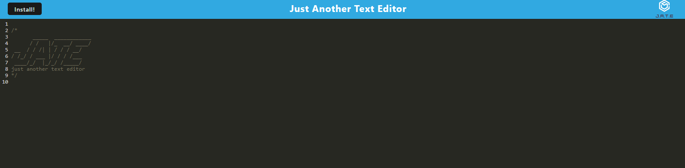

# pwa-text-editor

## Description

Just another text editor (JATE) is a single page progressive web application (PWA) which serves as a text editor. The application runs in the browser or can be downloaded and ran offline. The purpose of this application is to create notes with or without internet connection. The note will save once clicked away or refreshed, storing the data you have inputted.

Technologies Used include:

- IndexedDB
- Webpack
- Express.js
- Babel
- Render

Follow link for GitHub repository [pwa-text-editor](https://github.com/brandonlambrecht/pwa-text-editor)

## License

None

## Table of Contents

[Installation](#installation)

[Usage](#usage)

[Contribution](#contribution)

## Installation

To install necessary dependencies, run the following command:

     npm i

## Usage

To use the application type the following into the terminal

    npm run start

Once server is running at localhost:3000, the user will be able to add text and download the application using the Install button to run offline.

The application is ran on Render, a cloud based platform for running static, backend API's, databases and much more.

## Contribution

Open to any suggestions to improve the project. Create an issue with the description contribution and lets work together.
